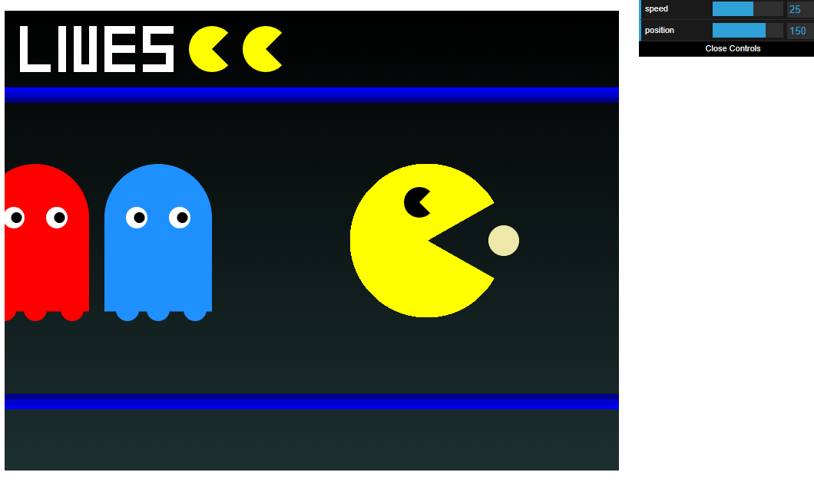

# JS Pacman animation

A Javascript canvas animation inspired by a classic game of Pacman. Uses dat.gui library to control the animation.

## Screenshots

## Technologies
* Mostly Javascript (canvas, dat.gui library)
* ... and a bit of HTML and CSS just to make JS work

## Features
* Ability to control animation using dat.gui controls
